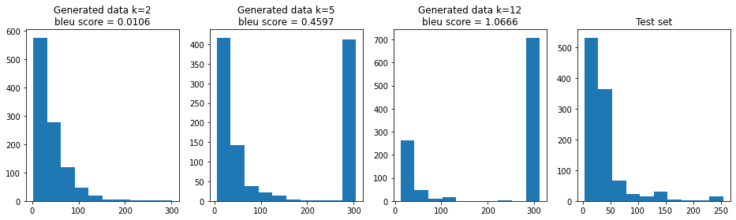
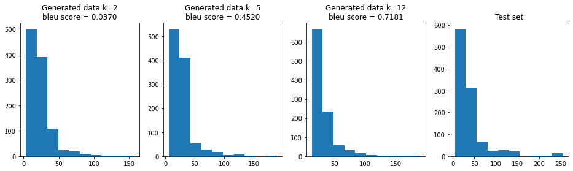

# AMP-Sequence-Generator

This project pertains to the problem of finding novel antimicrobial peptides (AMP) which may turn out to be key in the fight against antibiotics resistance. The dataset in this project comes from two open-source projects: amPEPpy and AMPlify. Given a corpus of AMP sequences, we tried to learn a character-level language model to generate new sequences of AMP. We implemented a baseline using a Markov model and then implemented a sequential model using an LSTM. For Validating the generated results, we took two approaches. Comparing the length distribution of generated results with reference inputs and calculating Bleu Score. The Bleu Score is a Method for Automatic Evaluation of Machine Translation. The Bleu score works by counting the number of matching n-grams in the generation outputs to n-grams in the corpus. The comparison is not made based on the order of words.

## Results
We used 80% of AMP sequences as a training set and evaluate our model by another 20% as a test set. In the following, we generated sequences by using our models for different k, where the k is the size of the input string.

*AMP sequences generated using Markov model*

*AMP sequences generated using LSTM*

As you can see, the Markov model couldn't generalize well and when we increase the size of the input string, detecting the end of the string for the Markov model gets harder and we can see a pick at the right side of the distribution. On the other hand, in the LSTM model, when we increase the input string's size, the distribution gets closer to the validation set and the bleu score increased.
